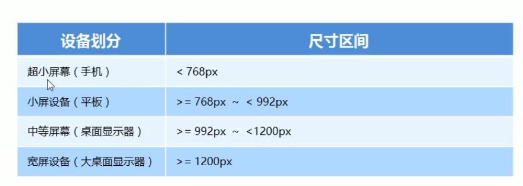
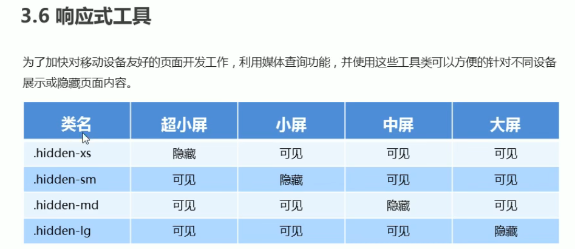

# Bootstrap_learn
- Twitter
- <a href="https://bootstrap.css88.com" >中文文档</a>
# 一、响应试开发
## 1.1 响应式开发原理
- 使用<span style="color:red;">媒体查询</span>针对不同宽度设备进行布局和样式的设置，从而<span style="color:red;">适配不同的设备</span>
- 
## 1.2 响应式布局容器
- 响应式需要一个父级元素作为布局容器，来配合子元素实现变化效果（通过媒体查询来实现）
# 二、bootstrap 的使用
## 2.1 容器的使用
- 1. .container容器 （<span style="color:red;">预定义类代替媒体查询</span>）
```html
<div class="container">你好</div>
```
- 2. contianer-fluid 类 100%宽（适合做移动端开发）
## 2.2 栅格系统（gridsystems）的使用
- 统一划分为12列
- Html(div{$}*3) alt+shift 光标下移 div.类名 (css: [class^="类名"]{}---类名全选)
- <span style="color:red;">超小：xs(extra small) 小：sm(small) 中等：md(medium) 大：lg(large)</span>
- 每一列默认有15像素的padding
```html
  <title>Document</title>
  <style>
    [class^="col"]{
      border: 1px solid red;
    }
  </style>
</head>
<body>
  <div class="container">
    <div class="row">
      <div class="col-lg-4 col-md-6 col-sm-12">1</div>
      <div class="col-lg-4 col-md-6 col-sm-12">2</div>
      <div class="col-lg-4 col-md-6 col-sm-12">3</div>
    </div>
    <div class="row">
      <!-- 当一行超过12列的时候回乡向下移动 -->
      <div class="col-lg-4">1</div>
      <div class="col-lg-4">2</div>
      <div class="col-lg-5">3</div>
    </div>
  </div>
```
## 2.3 栅格系统的列嵌套
- 列嵌套每一个col又被分为12列
- 在col 中加row可以完全占有排除padding
```html
<style>
  [class^="col-md-6"]{
    background-color: green;
    border: 0px solid blue;
  }
  [class^="col"]{
    border: 1px solid blue;
  }
  .card{
    width: 100%;
    background-color: pink;
  }
</style>
<body>
  <div class="container">
    <div class="row">
      <div class="col-lg-4">
        <!-- 加row 排除padding -->
        <div class="row">
          <!--col-lg-6 自带padding15px  -->
          <div class="col-lg-6">
            <!-- card 100%  -->
            <div class="card">
              111
            </div>
          </div>
          <div class="col-lg-6">
            <div class="card">
              222
            </div>
          </div>
        </div>
      </div>
      <div class="col-lg-4">2</div>
      <div class="col-lg-4">3</div>
    </div>
  </div>
</body>
```
## 2.4 栅格系统偏移
- offset
```html 
<body>
  <div class="container">
    <div class="row">
      <div class="col-md-4">1</div>
      <!-- 向右偏移4个列（给左侧盒子增加外边距） -->
      <div class="col-md-4 col-md-offset-4">2</div>
    </div>
  </div>
</body>
```
## 2.5 栅格系统偏移
- 右侧拉到左侧（pull） 左侧推到右侧(push)
```html
<body>
  <div class="container">
    <div class="row">
      <div class="col-md-8">左侧</div>
      <div class="col-md-4">右侧</div>
    </div>
    <!-- 右侧拉到左侧（pull） 左侧推到右侧(push) -->
    <div class="row">
      <div class="col-md-8 col-md-push-4">左侧</div>
      <div class="col-md-4 col-md-pull-8">右侧</div>
    </div>
  </div>
</body>
```
## 2.6 栅格系统响应式工具（显示隐藏）
- 隐藏
  - 超小屏隐藏（.hidden-xs）
  - 小屏隐藏（.hidden-sm）
  - 中屏隐藏（.hidden-md）
  - 大屏隐藏（.hidden-lg）
- 显示
  - 超小屏隐藏（.visible-xs）
  - 小屏隐藏（.visible-sm）
  - 中屏隐藏（.visible-md）
  - 大屏隐藏（.visible-lg）  
- 